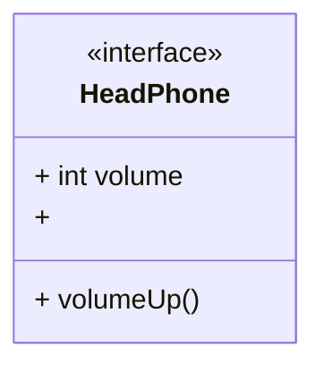

# Adapter pattern

> An Adapter acts as a wrapper between two object. It catches calls for on object and transforms them to format
> and interface recognizable by the second object.
> -- <cite>[Refactoring Guru](https://refactoring.guru/design-patterns/adapter/go/example)</cite>

OR

> Adapter is a structural design pattern that allows objects with incompatible interfaces to collaborate.
> -- <cite>[Refactoring Guru](https://refactoring.guru/design-patterns/adapter)</cite>

# Problem

You have some legacy code with a certain wanted behavior. However, you want to provide a different interface to the client. Before deprecating the old interface you can wrap the old implementation into an adapter with the new target interface which you can use.

Or

